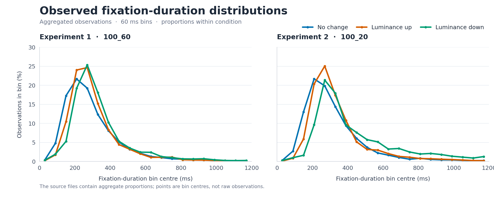

# Vision Research data

This page describes the public aggregate histograms and the supporting archive of processed fixation records from the historical Vision Research project.

> **At a glance** · 3 experiment sets · coded participant and trial IDs · 61 files · 16.2 MB compressed<br />
> The archive contains processed fixation/event records and analysis materials. It does **not** contain raw EDF/ASC eye-tracker recordings.

[Download the archive](vision-research.zip) · [Verify its SHA-256 checksum](vision-research.zip.sha256)

## Start here

The archive is a collection of related files rather than a single ready-to-analyze table. For the fixation analyses, the main path is:

```text
trial_time logs ── event/message records (including detected saccade markers)
        │
        └─ index mapping ── trial IDs / event context ───────────────┐
                                                                      │
processed_data_* ── saved processed event/fixation records ──────────┤
manipulate_only_* ── saved manipulation-event subset ────────────────┤
sceneid.txt ── scene labels ─────────────────────────────────────────┘
                                  │
                           report filters
                                  │
                    retained observations → histograms
```

The `processed_data_*` and `manipulate_only_*` objects are separate saved data frames; the latter is not a command that derives itself from the former. The report loads these precomputed tables; it does not build their fixation rows from the `trial_time` logs. The report uses manipulation-only records for up/down analyses and the broader processed records where it needs baseline/no-change observations. Experiment 3 (`BS`) is archived but is not included in the report's published histogram comparison.

## Published aggregate distributions

The figure plots the two aggregate files already included in the repository. Each curve shows the proportion of observations in successive 60 ms fixation-duration bins; points mark the bin centres.



Each MATLAB file contains a `human_data` matrix with 60 rows: 20 duration bins for each condition. The columns are condition ID (`1` = no change, `2` = luminance up, `3` = luminance down), proportion, and bin centre in milliseconds. Bin centres run from 30 ms to 1,170 ms.

| Experiment | Set | Public histogram |
| --- | --- | --- |
| 1 | `100_60` | [`h_fixdur_exp1.mat`](../_data/h_fixdur_exp1.mat) |
| 2 | `100_20` | [`h_fixdur_exp2.mat`](../_data/h_fixdur_exp2.mat) |

The plotted values are aggregated proportions. They do not show participant-level variation or uncertainty intervals.

## Archive inventory and coverage

[`vision-research.zip`](vision-research.zip) contains 61 substantive files across three experiment sets: `100_60` (Experiment 1), `100_20` (Experiment 2), and `BS` (Experiment 3).

| Files | Format | Purpose |
| --- | --- | --- |
| `processed_data_*.txt` | Gzip-compressed R serialized objects, despite the `.txt` suffix | Broader processed fixation/event data, including baseline and manipulation event types. |
| `manipulate_only_*.txt` | Gzip-compressed R serialized objects | Saved subset of events associated with manipulations; the archived report uses these for up/down conditions. |
| `exp1_*`, `exp2_*` timing, variable, and saccade-count files | Tab-separated text | Event/message exports with timestamps (including `SAC_ON`, `SAC_OFF`, and shift markers), trial variables, and trial-level saccade-count summaries. |
| `asymfix_exp*_ind2num.txt` | Tab-separated text | Event-log/trial-index mapping used to derive trial identifiers. |
| `sceneid.txt`, `SceneID/` | Text and MATLAB `.mat` files | Trial-to-scene mapping and per-subject scene metadata. |
| `VR_report.Rmd`, `VR_report.md`, `summarySE.R` | R Markdown and R source | Archived report and analysis helper. |

The three R object pairs have the following row counts. Participant counts are distinct coded `SUBJECT` values in the broader object.

| Experiment | Set | `processed_data` rows | `manipulate_only` rows | Participants |
| --- | --- | ---: | ---: | ---: |
| 1 | `100_60` | 123,120 | 17,922 | 22 |
| 2 | `100_20` | 90,070 | 14,350 | 18 |
| 3 | `BS` | 129,285 | 17,762 | 23 |

## Fixation record fields

All six saved R data frames share this 14-column schema. The base objects do **not** already contain `TRIAL_ID` or `Scene`; the report derives/joins those from the separate logs and mapping files.

| Column | Meaning and use |
| --- | --- |
| `SUBJECT` | Coded participant/session identifier; used as part of joins and grouping. |
| `TRIAL_NUM` | Recording trial index; used with `SUBJECT` to match event-log rows. |
| `PREVIOUS_FIX_DUR` | Duration of the previous fixation. The archived report treats fixation-duration values as milliseconds. |
| `NEXT_FIX_DUR` | Duration of the fixation after the current saccade, in milliseconds; this is the duration used for the published distributions. |
| `SHIFT_TYPE` | Event class. The broader objects include `BASELINE`, `MANIPULATION`, and `NONE`; the manipulation-only objects contain `MANIPULATION`. |
| `SHIFT_DIRECTION` | Direction/condition coding. Depending on object, values include `UP`, `DOWN`, `NONE`, or `CONTROL`. In the report, `NONE`/`CONTROL` are normalized to the baseline/no-change condition. |
| `MSG_TIME` | Timestamp associated with the event message. Preserve its source representation; the archive does not document a reliable unit/conversion here. |
| `CURRENT_SAC_AMPLITUDE` | Amplitude recorded for the current saccade; units are not documented in the archive. |
| `CURRENT_SAC_START_TIME` | Start timestamp for the current saccade; timestamp unit is not documented. |
| `CURRENT_SAC_END_TIME` | End timestamp for the current saccade; timestamp unit is not documented. |
| `NEXT_FIX_BASELINE` | Baseline-related value/flag for the next fixation, as recorded in the processed object. The legacy report does not define this field sufficiently to infer more. |
| `CURRENT_SAC_CONTAINS_BLINK` | Boolean blink indicator for the current saccade. |
| `NEXT_FIX_BLINK_AROUND` | Blink timing category around the next fixation; observed categories include `BEFORE`, `AFTER`, `BOTH`, and `NONE`. |
| `MS_PRIOR_SAC_END` | Milliseconds relative to the prior saccade end, as used by the report's nonnegative-value filter. |

Missing values occur in some fields (for example, `NEXT_FIX_DUR` is missing in two rows in each of the Experiment 1 and 2 manipulation-only tables). Check missingness in the object you are analyzing instead of assuming every column is complete. Categorical values also differ slightly between broad and manipulation-only objects, so inspect actual values before recoding.

## Loading and inspecting the archive

First verify and extract the archive:

```sh
cd data
sha256sum -c vision-research.zip.sha256
unzip vision-research.zip -d /path/to/output
```

In R, the compressed `.txt` files are read by `load()`. The saved object name matches the filename stem:

```r
load("/path/to/output/Vision Research/processed_data_100_60.txt")
load("/path/to/output/Vision Research/manipulate_only_100_60.txt")

dim(processed_data_100_60)
names(processed_data_100_60)
str(manipulate_only_100_60)
table(manipulate_only_100_60$SHIFT_DIRECTION, useNA = "ifany")
summary(manipulate_only_100_60$NEXT_FIX_DUR)
```

The timing and mapping files are tab-separated and can be read with `read.delim()` in R:

```r
events <- read.delim("/path/to/output/Vision Research/exp1_trial_time.txt")
head(events)
```

Python users can load the R objects with the third-party `rdata` package and inspect them as pandas data frames:

```python
import rdata

objects = rdata.read_rda(
    "/path/to/output/Vision Research/manipulate_only_100_60.txt"
)
fixations = objects["manipulate_only_100_60"]
print(fixations.shape)
print(fixations.dtypes)
print(fixations["SHIFT_DIRECTION"].value_counts(dropna=False))
```

The public histogram matrix is a separate, already-aggregated product:

```matlab
load('_data/h_fixdur_exp1.mat');
size(human_data) % 60 rows: 20 bins for each of 3 conditions
```

## Reconstructing the report's joins and filters

The `exp*_trial_time.txt` files have one row per message/event record, not one row per gaze sample or fixation. Their six columns are `RECORDING_SESSION_LABEL`, `CURRENT_MSG_TEXT`, `TRIAL_INDEX`, `Condition`, `CALIBRATION`, and `CURRENT_MSG_TIME`. Message text includes tracker/event markers such as `SAC_ON`, `sacstart`, `SAC_OFF`, `SHIFT_FROM_BASELINE`, and `SHIFT_TO_BASELINE`. These are event-level software output: they expose events detected/recorded by the acquisition pipeline, but they are not the underlying continuous EDF/ASC gaze samples. The archive does not document the exact export step or contain source gaze samples to reconstruct it independently.

The event logs and fixation tables are related by IDs, not by their row positions. In the report's joins, a `Trial_Info` value is parsed from event-message text in `asymfix_exp*_ind2num.txt`; `RECORDING_SESSION_LABEL` is renamed to `SUBJECT` and `TRIAL_INDEX` to `TRIAL_NUM`, then matched to fixation records on **both** `SUBJECT` and `TRIAL_NUM`. `sceneid.txt` adds `Scene` using subject and trial identifiers. Preserve the original keys and check for duplicate keys/many-to-many joins before interpreting merged row counts. This report-side joining/filtering is downstream of the saved fixation objects; it is not the step that parses continuous eye samples into those objects.

In outline, the report's publication filtering path:

1. Combines the relevant processed and manipulation-only records, normalizing control/no-shift labels to the baseline condition.
2. Excludes the first four trials for each participant (starts at that participant's fifth `TRIAL_ID`) and removes one specified Experiment 1 trial.
3. For shifted observations, requires `MS_PRIOR_SAC_END >= 0` and excludes observations with `NEXT_FIX_BLINK_AROUND` marked `BEFORE` or `AFTER`. These two rules have a baseline exception in the report.
4. Retains `NEXT_FIX_DUR > 50` and `NEXT_FIX_DUR < 1200` milliseconds (strict inequalities).
5. Computes condition-specific duration-bin proportions for the histogram.

This historical path yields 14,174 retained observations in Experiment 1 and 11,415 in Experiment 2. These are not simply all rows in the archive, nor are they participant counts. The Experiment 1 filtered durations reproduce the corresponding public histogram. Experiment 2 is close, with small bin-level differences that remain unexplained. The report is legacy code rather than a turnkey pipeline, so treat these numbers as a reference for that specific set of transformations.

## Scope and limitations

- The trial-time files are event-level software output; the saved fixation tables are already processed records. Neither is the raw continuous gaze-sample stream. No raw EDF/ASC recordings were present in the source archive.
- Saccade-on and saccade-off messages are present; no explicit cancellation event labels were found.
- Several time/amplitude fields do not have units or detailed definitions in the archived documentation. Do not infer units from names alone.
- The archived report is legacy code. The release copy removes workstation-specific absolute paths; rerunning may require adapting paths and installing the original R dependencies.
- The archive copy omits macOS Finder metadata. Its substantive data files are preserved; three workstation-specific paths in the report/helper script were replaced with comments.
- No data-specific license is declared. Contact the repository owner for reuse terms.

Regenerate the aggregate figure with `python data/plot_public_histograms.py` (requires NumPy, SciPy, and Matplotlib).
